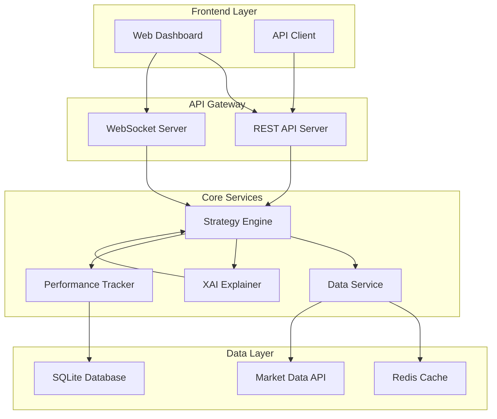
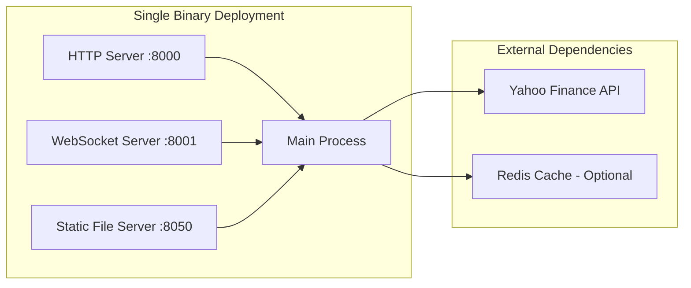

# Design Document

## Overview

The Rust Real-Time XAI Trading Platform will be a high-performance, memory-safe reimplementation of the existing Python platform. The system will leverage Rust's concurrency model, type safety, and performance characteristics to create a robust trading simulation platform capable of handling multiple concurrent users with real-time data processing.

The architecture will follow a microservices approach with clear separation between data ingestion, strategy execution, explanation generation, and user interface components. The system will prioritize performance, reliability, and maintainability while preserving all existing functionality.

## Architecture

### High-Level Architecture



### Technology Stack

- **Web Framework**: Axum (async, performant HTTP server)
- **WebSocket**: tokio-tungstenite (async WebSocket implementation)
- **Database**: SQLite with sqlx (embedded database for simplicity)
- **Caching**: Redis (optional, with in-memory fallback)
- **Market Data**: Custom HTTP client for Yahoo Finance API
- **Serialization**: serde with JSON
- **Async Runtime**: Tokio
- **Frontend**: Serve static files, integrate with existing Dash/React frontend

### Deployment Architecture



## Components and Interfaces

### 1. Strategy Engine

**Purpose**: Core component responsible for strategy execution and signal generation.

**Key Structures**:
```rust
#[derive(Debug, Clone, Serialize, Deserialize)]
pub struct Strategy {
    pub id: String,
    pub strategy_type: StrategyType,
    pub symbol: String,
    pub parameters: StrategyParameters,
    pub created_at: DateTime<Utc>,
    pub is_active: bool,
}

#[derive(Debug, Clone, Serialize, Deserialize)]
pub enum StrategyType {
    PriceDrop { threshold: f64 },
    MovingAverage { short_period: usize, long_period: usize },
    RSI { oversold: f64, overbought: f64 },
}

#[derive(Debug, Clone, Serialize, Deserialize)]
pub struct TradingSignal {
    pub strategy_id: String,
    pub symbol: String,
    pub action: Action,
    pub price: f64,
    pub timestamp: DateTime<Utc>,
    pub explanation: String,
    pub confidence: f64,
}

#[derive(Debug, Clone, Serialize, Deserialize)]
pub enum Action {
    Buy,
    Sell,
    Hold,
}
```

**Key Traits**:
```rust
#[async_trait]
pub trait StrategyExecutor {
    async fn execute(&self, market_data: &MarketData, historical_data: &[PricePoint]) -> Result<TradingSignal>;
    fn validate_parameters(&self) -> Result<()>;
}
```

### 2. Data Service

**Purpose**: Manages market data ingestion, caching, and distribution.

**Key Structures**:
```rust
#[derive(Debug, Clone, Serialize, Deserialize)]
pub struct MarketData {
    pub symbol: String,
    pub price: f64,
    pub volume: u64,
    pub timestamp: DateTime<Utc>,
    pub change: f64,
    pub change_percent: f64,
}

#[derive(Debug, Clone, Serialize, Deserialize)]
pub struct PricePoint {
    pub timestamp: DateTime<Utc>,
    pub open: f64,
    pub high: f64,
    pub low: f64,
    pub close: f64,
    pub volume: u64,
}
```

**Key Traits**:
```rust
#[async_trait]
pub trait MarketDataProvider {
    async fn get_current_price(&self, symbol: &str) -> Result<MarketData>;
    async fn get_historical_data(&self, symbol: &str, days: u32) -> Result<Vec<PricePoint>>;
    async fn subscribe_to_updates(&self, symbol: &str) -> Result<Receiver<MarketData>>;
}
```

### 3. XAI Explainer

**Purpose**: Generates human-readable explanations for trading decisions.

**Key Structures**:
```rust
#[derive(Debug, Clone)]
pub struct ExplanationContext {
    pub strategy_type: StrategyType,
    pub action: Action,
    pub market_data: MarketData,
    pub strategy_data: HashMap<String, f64>,
    pub historical_context: Option<MarketContext>,
}

#[derive(Debug, Clone)]
pub struct Explanation {
    pub summary: String,
    pub detailed_reasoning: String,
    pub market_context: String,
    pub risk_factors: Vec<String>,
    pub confidence_level: f64,
}
```

**Key Traits**:
```rust
pub trait ExplanationGenerator {
    fn generate_explanation(&self, context: &ExplanationContext) -> Explanation;
    fn get_risk_factors(&self, strategy_type: &StrategyType) -> Vec<String>;
}
```

### 4. Performance Tracker

**Purpose**: Tracks strategy performance metrics and trade history.

**Key Structures**:
```rust
#[derive(Debug, Clone, Serialize, Deserialize)]
pub struct PerformanceMetrics {
    pub strategy_id: String,
    pub total_return: f64,
    pub total_trades: u32,
    pub winning_trades: u32,
    pub losing_trades: u32,
    pub current_position: Position,
    pub max_drawdown: f64,
    pub sharpe_ratio: Option<f64>,
}

#[derive(Debug, Clone, Serialize, Deserialize)]
pub struct Position {
    pub symbol: String,
    pub shares: f64,
    pub average_price: f64,
    pub current_value: f64,
    pub unrealized_pnl: f64,
}

#[derive(Debug, Clone, Serialize, Deserialize)]
pub struct Trade {
    pub id: String,
    pub strategy_id: String,
    pub symbol: String,
    pub action: Action,
    pub quantity: f64,
    pub price: f64,
    pub timestamp: DateTime<Utc>,
    pub explanation: String,
}
```

### 5. WebSocket Manager

**Purpose**: Manages real-time communication with frontend clients.

**Key Structures**:
```rust
#[derive(Debug, Clone, Serialize, Deserialize)]
pub struct WebSocketMessage {
    pub message_type: MessageType,
    pub strategy_id: Option<String>,
    pub data: serde_json::Value,
    pub timestamp: DateTime<Utc>,
}

#[derive(Debug, Clone, Serialize, Deserialize)]
pub enum MessageType {
    InitialData,
    MarketUpdate,
    TradingSignal,
    PerformanceUpdate,
    Error,
    Heartbeat,
}
```

## Data Models

### Database Schema

```sql
-- Strategies table
CREATE TABLE strategies (
    id TEXT PRIMARY KEY,
    strategy_type TEXT NOT NULL,
    symbol TEXT NOT NULL,
    parameters TEXT NOT NULL, -- JSON
    created_at DATETIME NOT NULL,
    is_active BOOLEAN NOT NULL DEFAULT TRUE
);

-- Trades table
CREATE TABLE trades (
    id TEXT PRIMARY KEY,
    strategy_id TEXT NOT NULL,
    symbol TEXT NOT NULL,
    action TEXT NOT NULL,
    quantity REAL NOT NULL,
    price REAL NOT NULL,
    timestamp DATETIME NOT NULL,
    explanation TEXT,
    FOREIGN KEY (strategy_id) REFERENCES strategies(id)
);

-- Performance snapshots table
CREATE TABLE performance_snapshots (
    id INTEGER PRIMARY KEY AUTOINCREMENT,
    strategy_id TEXT NOT NULL,
    total_return REAL NOT NULL,
    total_trades INTEGER NOT NULL,
    timestamp DATETIME NOT NULL,
    metrics TEXT NOT NULL, -- JSON
    FOREIGN KEY (strategy_id) REFERENCES strategies(id)
);

-- Market data cache table
CREATE TABLE market_data_cache (
    symbol TEXT NOT NULL,
    timestamp DATETIME NOT NULL,
    price REAL NOT NULL,
    volume INTEGER,
    change_percent REAL,
    PRIMARY KEY (symbol, timestamp)
);
```

### Configuration Model

```rust
#[derive(Debug, Clone, Deserialize)]
pub struct Config {
    pub server: ServerConfig,
    pub database: DatabaseConfig,
    pub market_data: MarketDataConfig,
    pub cache: CacheConfig,
    pub strategies: StrategyConfig,
}

#[derive(Debug, Clone, Deserialize)]
pub struct ServerConfig {
    pub host: String,
    pub port: u16,
    pub websocket_port: u16,
    pub static_port: u16,
    pub cors_origins: Vec<String>,
}

#[derive(Debug, Clone, Deserialize)]
pub struct MarketDataConfig {
    pub provider: String, // "yahoo_finance"
    pub update_interval_seconds: u64,
    pub historical_days: u32,
    pub rate_limit_delay_ms: u64,
    pub max_retries: u32,
    pub timeout_seconds: u64,
}
```

## Error Handling

### Error Types

```rust
#[derive(Debug, thiserror::Error)]
pub enum TradingPlatformError {
    #[error("Strategy error: {0}")]
    Strategy(#[from] StrategyError),
    
    #[error("Market data error: {0}")]
    MarketData(#[from] MarketDataError),
    
    #[error("Database error: {0}")]
    Database(#[from] sqlx::Error),
    
    #[error("WebSocket error: {0}")]
    WebSocket(#[from] tokio_tungstenite::tungstenite::Error),
    
    #[error("Serialization error: {0}")]
    Serialization(#[from] serde_json::Error),
    
    #[error("Configuration error: {0}")]
    Config(String),
    
    #[error("Network error: {0}")]
    Network(#[from] reqwest::Error),
}

#[derive(Debug, thiserror::Error)]
pub enum StrategyError {
    #[error("Invalid strategy parameters: {0}")]
    InvalidParameters(String),
    
    #[error("Strategy not found: {0}")]
    NotFound(String),
    
    #[error("Strategy execution failed: {0}")]
    ExecutionFailed(String),
    
    #[error("Insufficient historical data")]
    InsufficientData,
}

#[derive(Debug, thiserror::Error)]
pub enum MarketDataError {
    #[error("Symbol not found: {0}")]
    SymbolNotFound(String),
    
    #[error("API rate limit exceeded")]
    RateLimitExceeded,
    
    #[error("Data provider unavailable")]
    ProviderUnavailable,
    
    #[error("Invalid data format")]
    InvalidFormat,
}
```

### Error Recovery Strategies

1. **Network Failures**: Implement exponential backoff with jitter
2. **API Rate Limits**: Queue requests and implement rate limiting
3. **Data Corruption**: Validate all incoming data and fallback to cache
4. **WebSocket Disconnections**: Automatic reconnection with exponential backoff
5. **Database Errors**: Transaction rollback and retry logic

## Testing Strategy

### Unit Testing
- Test each strategy implementation with mock market data
- Test explanation generation with various market conditions
- Test performance calculation accuracy
- Test error handling and edge cases

### Integration Testing
- Test WebSocket communication end-to-end
- Test database operations with real schema
- Test market data provider integration
- Test concurrent strategy execution

### Performance Testing
- Load testing with multiple concurrent WebSocket connections
- Memory usage profiling with long-running strategies
- Latency testing for real-time data processing
- Stress testing with high-frequency market data updates

### Test Data Strategy
```rust
// Mock market data for testing
pub struct MockMarketDataProvider {
    price_scenarios: HashMap<String, Vec<PricePoint>>,
    current_prices: HashMap<String, f64>,
}

// Test fixtures for strategies
pub fn create_test_price_drop_strategy() -> Strategy {
    Strategy {
        id: "test-price-drop".to_string(),
        strategy_type: StrategyType::PriceDrop { threshold: 5.0 },
        symbol: "AAPL".to_string(),
        parameters: StrategyParameters::default(),
        created_at: Utc::now(),
        is_active: true,
    }
}
```

## Security Considerations

### Input Validation
- Validate all strategy parameters before execution
- Sanitize stock symbols to prevent injection attacks
- Rate limit API endpoints to prevent abuse
- Validate WebSocket message formats

### Data Protection
- Use prepared statements for all database queries
- Encrypt sensitive configuration data
- Implement proper CORS policies
- Log security events for monitoring

### Resource Protection
- Limit maximum number of concurrent strategies per user
- Implement memory limits for historical data caching
- Rate limit WebSocket connections
- Monitor CPU and memory usage

## Performance Optimizations

### Concurrency Model
- Use Tokio's async runtime for non-blocking I/O
- Implement actor pattern for strategy execution
- Use channels for inter-component communication
- Leverage Rust's zero-cost abstractions

### Memory Management
- Use Arc<> for shared immutable data
- Implement LRU cache for historical data
- Stream large datasets instead of loading into memory
- Use efficient data structures (Vec, HashMap)

### Caching Strategy
- Cache market data with TTL expiration
- Cache strategy execution results for duplicate requests
- Use Redis for distributed caching (optional)
- Implement write-through caching for performance metrics

### Database Optimization
- Use connection pooling for database access
- Implement batch inserts for trade history
- Create appropriate indexes for query performance
- Use prepared statements for repeated queries

## Monitoring and Observability

### Metrics Collection
```rust
pub struct PlatformMetrics {
    pub active_strategies: AtomicU64,
    pub total_trades_executed: AtomicU64,
    pub websocket_connections: AtomicU64,
    pub market_data_requests: AtomicU64,
    pub error_count: AtomicU64,
    pub average_response_time: AtomicU64,
}
```

### Logging Strategy
- Use structured logging with tracing crate
- Log all trading decisions with context
- Log performance metrics periodically
- Log errors with full context for debugging

### Health Checks
- Implement health check endpoints
- Monitor database connectivity
- Monitor market data provider availability
- Monitor WebSocket connection health